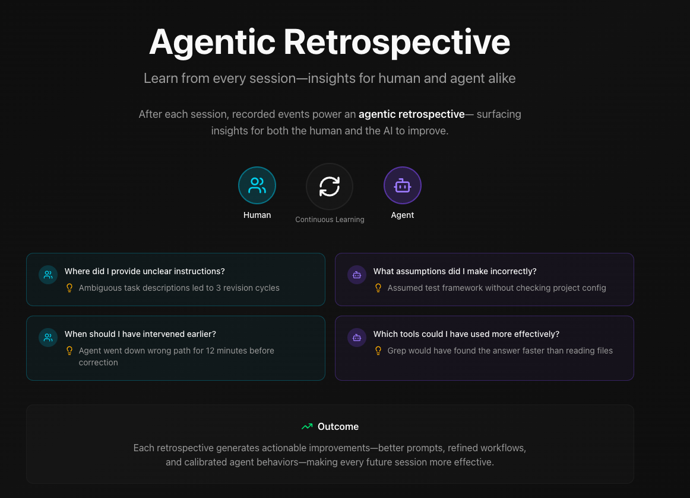

# Agentic Retrospective

[](https://www.npmjs.com/package/@daax-dev/retrospective)
[](https://www.npmjs.com/package/@daax-dev/retrospective)
[](https://agentskills.io)

Evidence-based sprint retrospectives for human-agent collaboration. **No AI slop** - every finding links to specific commits, PRs, or decisions.

## What Makes This Different



Most retrospective tools produce vague observations like "58 tool invocations across 7 tools". That's useless.

This tool produces **objective, evidence-based metrics**:

| Metric | Example Output |
|--------|----------------|
| Commit Breakdown | "59.7% fixes (227/380), 10.8% features (41/380), 1.6% tests (6/380)" |
| Rework Rate | "15/20 PRs superseded (75% rework)" |
| Testing Discipline | "2% of decisions mention testing" |
| Decision Quality | "78% have both rationale AND context" |
| Agent Contribution | "45 commits (11.8%) by agents" |

### Before vs After

**Before (AI Slop):**
```
### Tool Usage
Observation: 58 total tool invocations across 7 different tools
Top Tools: Bash (39), Glob (6), Read (4)
```

**After (Evidence-Based):**
```
### Executive Summary

| Metric | Value |
|--------|-------|
| Total Commits | 380 |
| PRs Superseded (Rework) | 15 (75.0%) |
| Testing Loop Adherence | 2.0% |
| Decision Quality Score | 78.0% |
| Reactive Work Ratio | 87.6% |

### What Didn't Work
| Metric | Value | Issue |
|--------|-------|-------|
| Testing Discipline | 2% | Agent not testing before push |
| Supersession Rate | 75% | Poor initial PR quality |
```

## Installation

### Quick run (no install)

```bash
npx @daax-dev/retrospective
```

### Global install

```bash
npm install -g @daax-dev/retrospective
# Then run:
agentic-retrospective
```

### As Claude Code Plugin

```bash
claude mcp install github.com/daax-dev/agentic-retrospective
```

## Usage

### Basic

```bash
# Analyze last 2 weeks (default)
npx @daax-dev/retrospective

# Analyze from specific ref
npx @daax-dev/retrospective --from HEAD~50
npx @daax-dev/retrospective --from "2 weeks ago"

# Output JSON only
npx @daax-dev/retrospective --json
```

### Session Feedback

```bash
npx @daax-dev/retrospective feedback
```

30-second survey to capture alignment, rework needed, and session quality.

## Metrics Calculated

### From Git History
- **Commit Type Breakdown**: feat/fix/docs/test/refactor/chore
- **Checkpoint Commits**: wip/save/tmp patterns
- **Reactive vs Proactive Ratio**: fixes vs features
- **Agent Commit Detection**: Co-authored-by patterns, bot emails
- **Rework Chains**: fix commits following features
- **Code Hotspots**: files changed 3+ times

### From GitHub (requires `gh` CLI)
- **PR Supersession Rate**: PRs that replaced other PRs
- **PRs with Test Files**: PRs including test/spec files
- **Review Metrics**: approval times, revision cycles
- **Negative Reviews**: CHANGES_REQUESTED count

### From Decision Logs
- **Decision Quality Score**: % with both rationale AND context
- **Testing Discipline**: % mentioning tests
- **Decision Thrash**: conflicting decisions on same topic
- **Risk Profile**: one-way-doors missing reversibility plans

### From Security Scans
- **Vulnerability Counts**: critical/high/medium/low
- **Scan Sources**: Trivy, npm audit, Snyk

## Data Sources

### Required
- **Git History** - Automatically extracted

### Optional (Enhanced Analysis)

| Source | Location | Enables |
|--------|----------|---------|
| Decision Logs | `.logs/decisions/*.jsonl` | Decision quality, testing discipline |
| Security Scans | `.logs/security/*.json` | Vulnerability analysis |
| Feedback | `.logs/feedback/*.jsonl` | Alignment tracking |
| Tool Logs | `.logs/tools/*.jsonl` | Tool usage patterns |

### Setup Directories

```bash
mkdir -p .logs/decisions .logs/security .logs/feedback .logs/tools
```

## Report Output

Reports are generated at `docs/retrospectives/retrospective-YYYY-MM-DD/`:

| File | Contents |
|------|----------|
| `retrospective.md` | Human-readable report |
| `retrospective.json` | Structured data |
| `evidence_map.json` | Commit/decision index |
| `alerts.json` | Critical findings for automation |

### Report Sections

1. **Executive Summary** - 10+ key metrics in table format
2. **Code Hotspots** - Files with high churn
3. **Commit Type Breakdown** - Work classification
4. **PR Analysis** - Rework rate, test coverage
5. **What Worked / What Didn't** - Threshold-based (>70% good, <50% bad)
6. **Testing Discipline** - Loop adherence %
7. **Mistakes & Corrections** - Documented learnings
8. **Recommendations** - Current | Target | Action format

## Graceful Degradation

Always produces useful output with available data:

| Missing Source | Impact |
|----------------|--------|
| Decision logs | Decision score = null, gap recorded |
| Security scans | Security score = null, gap recorded |
| GitHub access | No PR metrics, git-only analysis |
| Feedback logs | No alignment tracking |

## Principles

1. **Evidence-Driven** - Every claim links to commits, PRs, or decisions
2. **Blameless** - Evaluates systems and patterns, not people
3. **Objective** - Percentages and counts, not vague observations
4. **Actionable** - Recommendations include current state, target, and action

## Development

```bash
# Install
pnpm install

# Build
pnpm run build

# Test (243 tests)
pnpm test

# Full validation
pnpm run validate
```

## License

Apache 2.0
